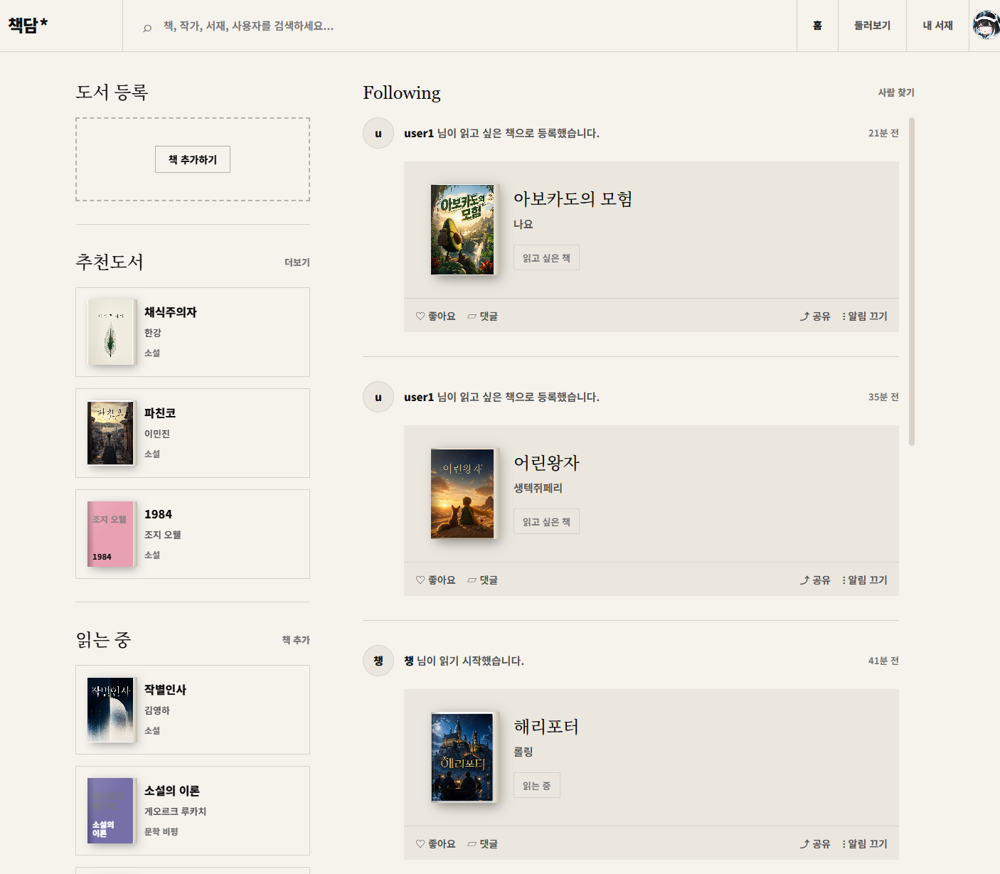
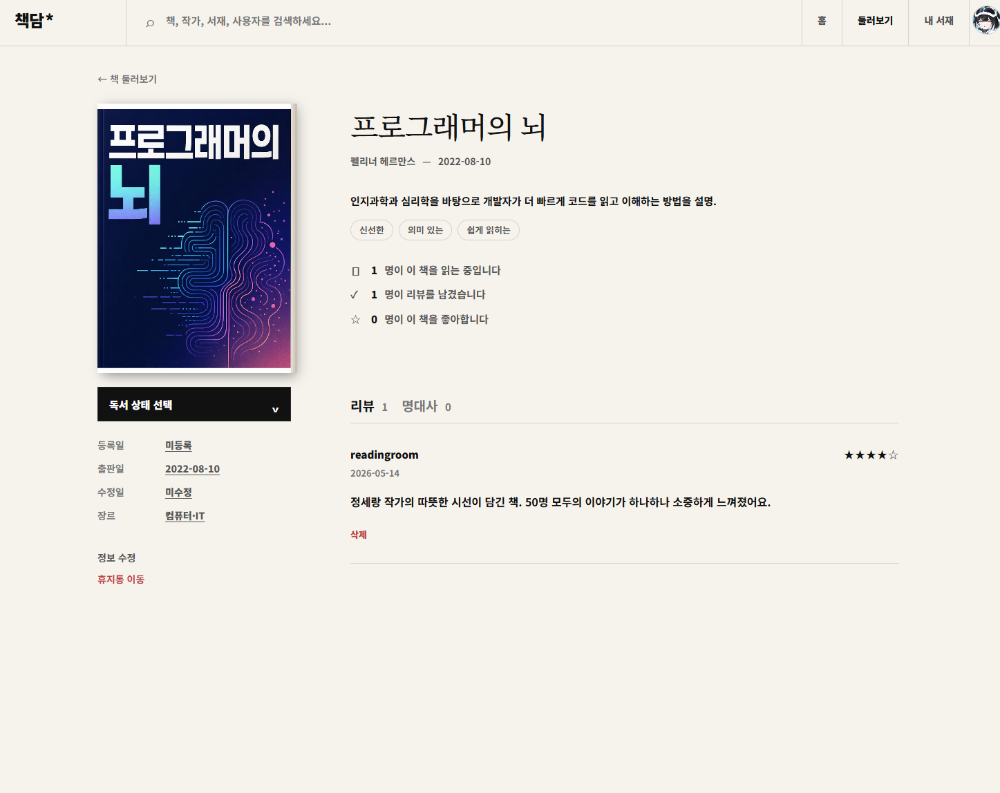
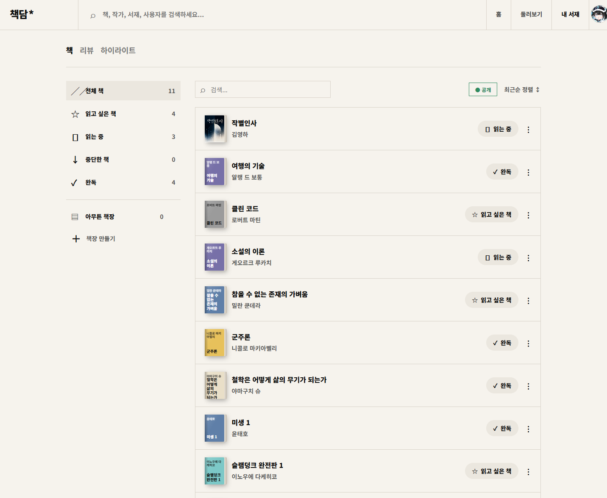
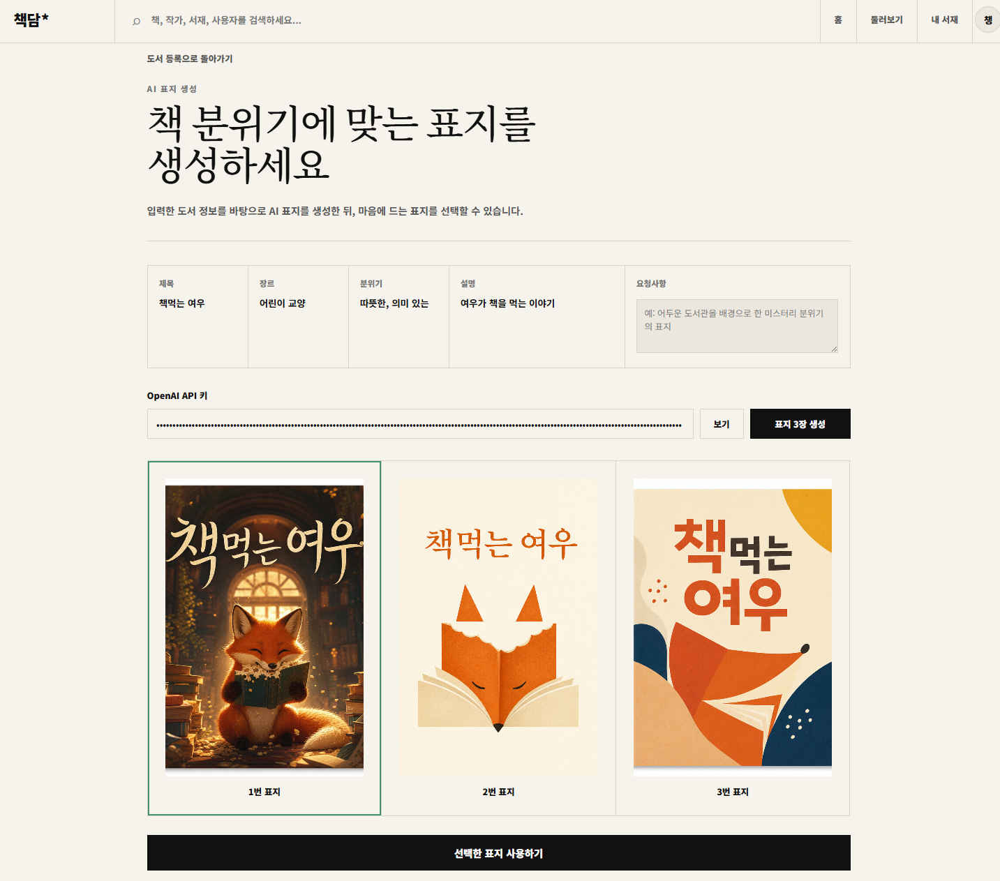
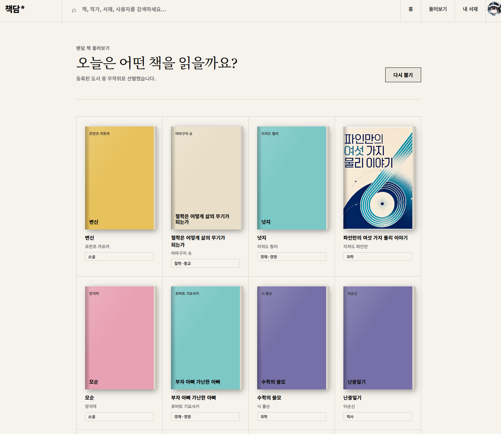

# 📚 책담 (Chaekdam)

> 책 + 이야기(담) — 도서를 기록하고, 추천받고, 다른 사람과 함께 읽는 **소셜 도서 관리 플랫폼**

내 서재에 책을 등록하고 독서 상태를 관리하며, AI로 책 표지를 생성하고, 다른 사용자를 팔로우해 독서 활동을 피드로 공유할 수 있는 풀스택 웹 애플리케이션입니다.

---

# 👥 역할 분담

| 역할                  | 담당자      | 담당 업무                                                                                     |
| ------------------- | -------- | ----------------------------------------------------------------------------------------- |
| 📋 PM               | 성현욱      | - ERD / API 정의서 작성<br>- README.md 작성<br>- 발표 자료 준비<br>- 통합 이슈 추적                          |
| ⚙️ 백엔드 개발 1         | 김남호      | - Book Entity 작성<br>- BookRepository 구현<br>- H2 콘솔 확인<br>- Lombok 4종 적용                   |
| 🛠️ 백엔드 개발 2        | 손가영, 이채현 | - BookService 클래스 구현<br>- 비즈니스 로직 작성<br>- BookNotFoundException 처리<br>- @Transactional 처리 |
| 🔗 백엔드 개발 3         | 이세은, 조영진 | - BookController 구현<br>- 5종 CRUD 엔드포인트 작성<br>- @Valid + @NotBlank 적용<br>- Postman 테스트     |
| 🚨 통합 / 예외 처리       | 류연우      | - WebConfig (CORS) 설정<br>- GlobalExceptionHandler 구현<br>- 로드맵 디버깅<br>- 트러블슈팅 정리           |
| 🤖 AI / Frontend 연동 | 박병린      | - Frontend 코드 분석<br>- fetch URL 변경 및 1차 연동<br>- OpenAI 표시 흐름 구현<br>- E2E 시연 준비            |

## ✨ 주요 기능

| 분류 | 기능 |
| --- | --- |
| **도서 관리** | 도서 등록·수정·삭제, 휴지통(소프트 삭제)·복구, 독서 상태(읽고 싶은/읽는 중/중단/완독) 관리 |
| **서재 & 책장** | 개인 서재, 커스텀 책장 생성/배정, 서재 공개·비공개 설정 |
| **탐색 & 추천** | 전체 도서 탐색, 분위기 기반 필터, 맞춤 추천(장르·분위기 분석), 랜덤 도서 |
| **리뷰 & 하이라이트** | 별점·태그 리뷰 작성, 인상 깊은 문장(하이라이트) 기록, 스포일러 표시 |
| **AI 표지 생성** | OpenAI 이미지 API로 3가지 디자인(시네마틱/미니멀/추상 타이포)의 책 표지 자동 생성 |
| **소셜** | 사용자 검색, 팔로우/언팔로우, 팔로잉 피드, 피드 좋아요·댓글 |
| **독서 목표** | 연간 독서 목표 설정, 진행률 추적, 목표에 책 추가 |

---

## 📸 스크린샷

> 아래 자리에 실제 화면 캡처를 추가하세요. (`docs/screenshots/` 폴더에 이미지를 넣고 경로를 연결)

| 홈 / 피드 | 도서 상세                                      | 둘러보기 |
| ---|---|---|
|  |  |  |

| 내 서재 | AI 표지 생성 | 도서 추천 |
| --- | --- | --- |
|  |  | 

<!--
이미지 추가 방법:
1. docs/screenshots/ 폴더 생성
2. 캡처 이미지를 home.png, book-detail.png 등으로 저장
3. 필요에 따라 표/행을 추가하거나 삭제
-->

---

## 🛠 기술 스택

### Backend
- **Java 17**, **Spring Boot 4.0.6**
- Spring Data JPA, Spring Validation, Spring Web MVC
- **MySQL** (mysql-connector-j)
- Lombok, Spring Security Crypto (비밀번호 암호화)
- Gradle

### Frontend
- **React 19**, **Vite 6**
- React Router DOM 7
- Plain CSS (디자인 시스템 / CSS 변수 기반 테마)

### External
- **OpenAI Image Generation API** (AI 표지 생성)

---

## 📁 프로젝트 구조

```
bookapp/
├── bookapp/                # 백엔드 (Spring Boot)
│   └── src/main/java/com/aivle/bookapp/
│       ├── controller/     # REST 컨트롤러
│       ├── service/        # 비즈니스 로직
│       ├── repository/     # JPA 리포지토리
│       ├── entity/         # JPA 엔티티
│       ├── dto/            # 요청/응답 DTO
│       ├── config/         # CORS, 비밀번호 설정
│       └── exception/      # 전역 예외 처리
│
├── frontend/               # 프론트엔드 (React + Vite)
│   └── src/
│       ├── api/            # API 호출 모듈 (apiFetch 래퍼)
│       ├── components/     # 재사용 컴포넌트
│       ├── context/        # 전역 상태 (Auth, ReadingGoal)
│       ├── pages/          # 페이지 컴포넌트
│       ├── styles/         # CSS
│       └── constants.js    # 공용 상수
│
└── docs/                   # 문서
    ├── API.md              # API 명세서
    └── schema.dbml         # ER 다이어그램 (dbdiagram.io)
```

---

## 🚀 실행 방법

### 사전 요구사항
- JDK 17+
- Node.js 18+
- **MySQL 8.x** (포트 3306 실행 중)

### 1. 데이터베이스 준비 (MySQL)
- MySQL 서버를 **포트 3306**에서 실행합니다.
- 기본 접속값: host `localhost`, user `root`, DB명 `bookapp`.
  접속 URL에 `createDatabaseIfNotExist=true`가 있어 **`bookapp` DB는 없으면 자동 생성**됩니다.
- 접속 정보가 다르면 환경변수로 덮어쓸 수 있습니다:
  `DB_HOST`, `DB_PORT`, `DB_NAME`, `DB_USERNAME`, `DB_PASSWORD`
  ```bash
  # 예: 비밀번호가 있는 경우
  set DB_PASSWORD=yourpassword   # Windows
  export DB_PASSWORD=yourpassword # macOS/Linux
  ```

### 2. 백엔드 실행
```bash
cd bookapp
./gradlew bootRun        # Windows: gradlew.bat bootRun
```
- 서버: `http://localhost:8080`
- `ddl-auto: update` 설정으로 **엔티티 기준 테이블이 자동 생성**되고 데이터가 영속됩니다.

### (선택) 기존 데이터 가져오기
처음 실행해 테이블이 생성된 뒤, 예전 H2 데이터를 한 번만 import 하면 됩니다.
```bash
mysql -u root -p bookapp < bookapp/db/mysql-seed.sql
```
> `bookapp/db/mysql-seed.sql`은 기존 H2 DB에서 추출한 시드(책·유저·리뷰·피드 등)입니다.
> **최초 1회만** 실행하세요(재실행 시 PK 중복). import 후에는 삭제해도 됩니다.

### 2. 프론트엔드 실행
```bash
cd frontend
npm install
npm run dev
```
- 개발 서버: `http://localhost:5173`
- API 주소는 `VITE_API_BASE_URL` 환경변수로 지정(미설정 시 `http://localhost:8080`).

> 백엔드가 `localhost:5173`, `5174`, `3000` Origin에 대해 CORS를 허용하도록 설정되어 있습니다.

---

## ☁️ AWS 배포 (CI/CD)

CodeBuild(`buildspec.yml`) → CodeDeploy(`appspec.yml`, `deploy-scripts/`) 파이프라인이 구성돼 있습니다.

**DB 접속 (RDS)** — 코드/yml에 비밀번호를 넣지 않고 EC2의 env 파일로 주입합니다.
```bash
sudo mkdir -p /etc/chaekdam
sudo tee /etc/chaekdam/db.env >/dev/null <<'EOF'
DB_HOST=<RDS 엔드포인트>
DB_PORT=3306
DB_NAME=bookapp
DB_USERNAME=admin
DB_PASSWORD=********
CORS_ALLOWED_ORIGINS=http://<프론트-도메인-또는-IP>
EOF
sudo chmod 600 /etc/chaekdam/db.env
```
배포 시 `application-start-hook.sh`가 이 파일을 읽어 앱에 환경변수로 전달합니다.
(파일이 없으면 `application.yaml` 기본값 `localhost:3306` / CORS는 localhost로 동작)

**CORS** — 운영 프론트 주소에서 API를 호출하려면 위 `CORS_ALLOWED_ORIGINS`에
프론트 도메인/IP를 지정합니다(콤마로 여러 개 가능, `http://13.124.*.*` 같은 패턴 허용).

**프론트 API 주소** — 빌드 시점에 굽히므로 CodeBuild 환경변수 `VITE_API_BASE_URL`에
운영 백엔드 주소(예: `http://<EC2-IP>:8080`)를 지정합니다. (`buildspec.yml` 상단 주석 참고)

**체크리스트**
- RDS 보안그룹에서 EC2 → 3306 인바운드 허용
- 최초 1회 시드 import: `mysql -h <RDS> -u admin -p bookapp < bookapp/db/mysql-seed.sql`

---

## 🔑 AI 표지 생성 사용법

AI 표지 생성 기능은 **사용자 본인의 OpenAI API 키**를 사용합니다.
1. [OpenAI Platform](https://platform.openai.com/api-keys)에서 API 키 발급
2. 도서 등록 / 표지 생성 화면에서 키 입력 (브라우저 localStorage에 저장)
3. "AI 표지 생성하기" 클릭 → 3가지 디자인 시안 생성

---

## 📖 문서

- **[API 명세서](./docs/API.md)** — 전체 REST 엔드포인트, 요청/응답 형식
- **[ER 다이어그램 (DBML)](./docs/schema.dbml)** — [dbdiagram.io](https://dbdiagram.io)에 붙여넣어 시각화

---

## 🗄 데이터 모델 (요약)

| 엔티티 | 설명 |
| --- | --- |
| `User` | 회원 계정 (이메일/사용자명/닉네임, 서재 공개 여부) |
| `Book` | 도서 (소유자, 독서 상태, 책장, 분위기 태그, 소프트 삭제) |
| `Bookshelf` | 사용자 커스텀 책장 |
| `Review` / `Highlight` | 리뷰(별점·태그) / 인상 깊은 문장 |
| `Follow` | 팔로우 관계 (자기참조) |
| `Feed` / `FeedComment` / `FeedLike` | 활동 피드 및 상호작용 |
| `BookLike` | 도서 좋아요 |

> 인증은 JWT 없이 로그인 후 클라이언트가 `userId`를 보관하는 방식입니다.

---
